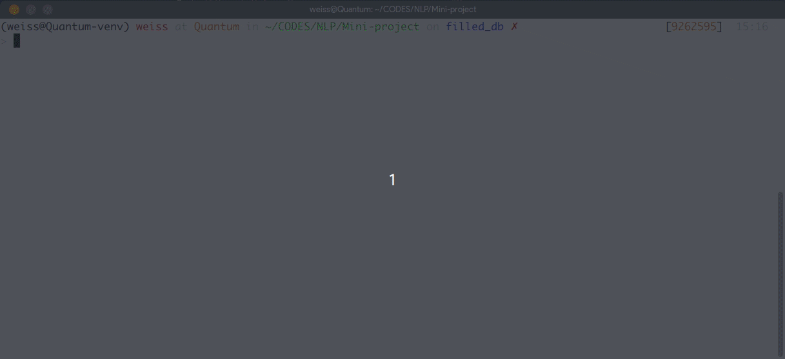
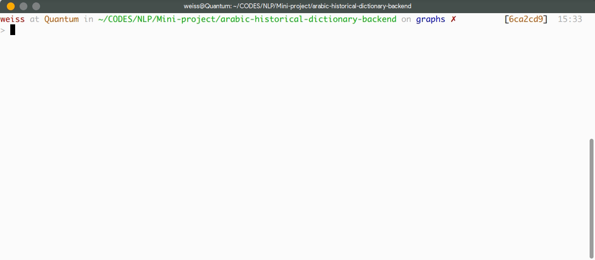
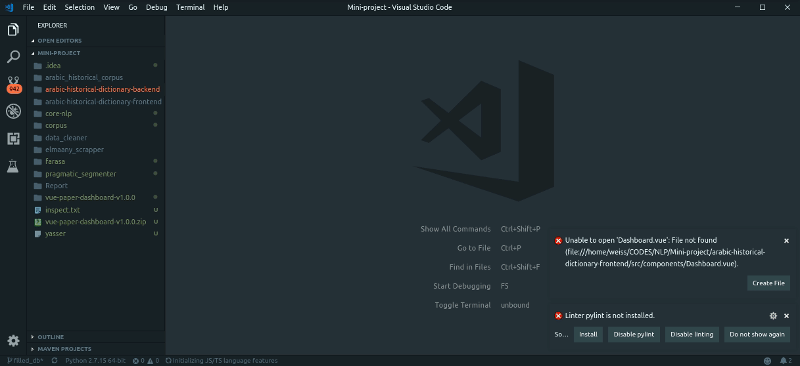
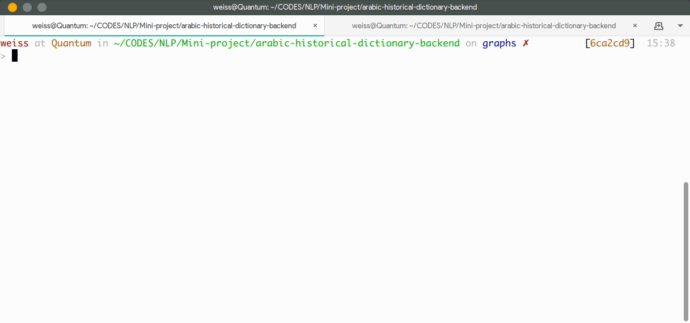
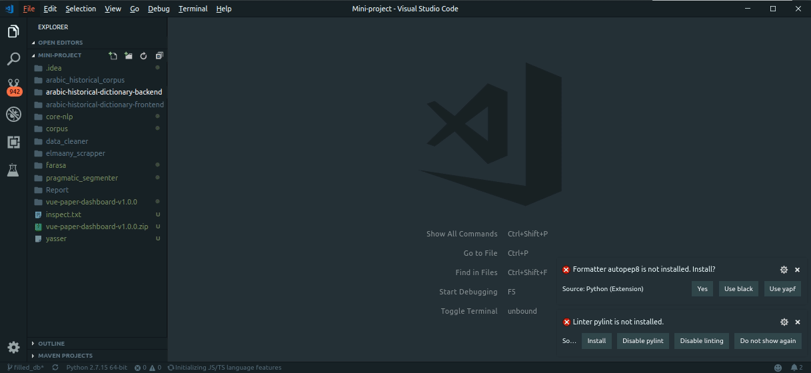
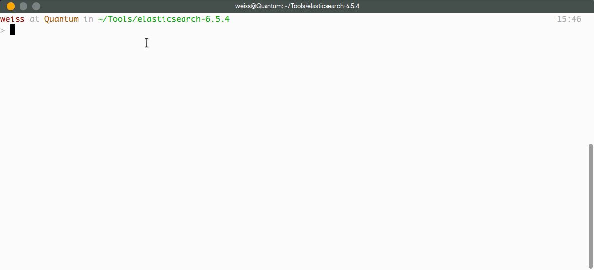
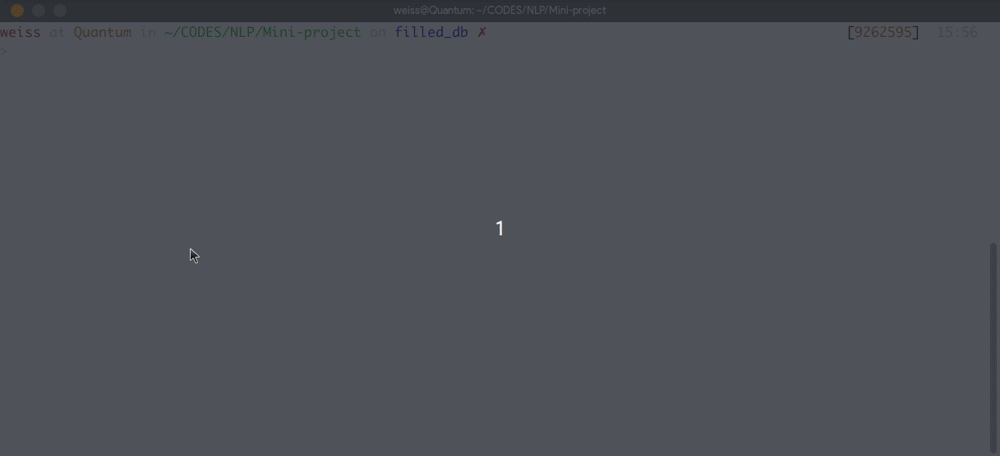
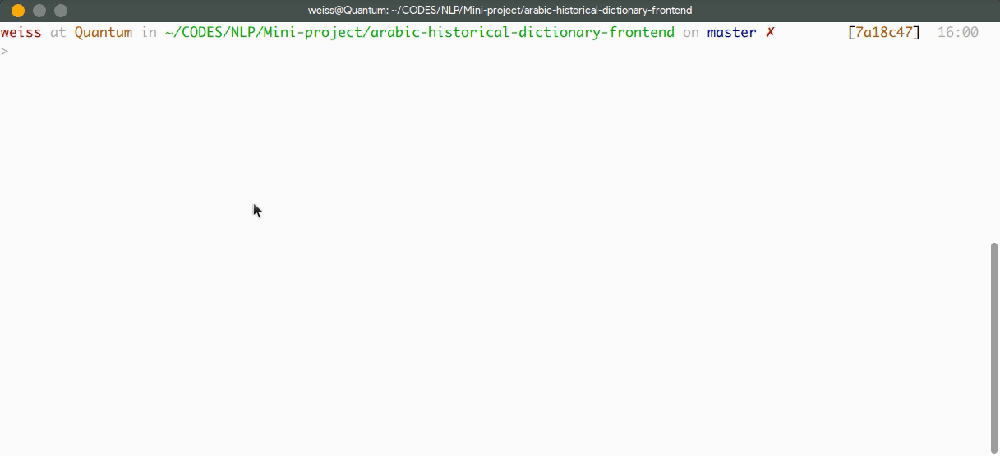

# المعين: القاموس التاريخي

## Introduction
The main goal of this project is to provide an online plateform that aims to help lexicographers in the task of creating and maintaining an arabic historical dictionary, and is an inititive of the professor A.Guessoum who teaches at the University of Sciences and Technology Houari Boumediene in Bab Ezzouar, Algiers, Algeria. We proposed our solution to this problem and decided to open-source it so that the community could contribute to this project.


## Installation guide

First things first, clone the two repositories 
[frontend](https://github.com/mohammedi-haroune/arabic-historical-dictionary-frontend) and [backend](https://github.com/mohammedi-haroune/arabic-historical-dictionary-backend). We will then begin by setting up the backend : 

---
### Backend

First we will need to install some dependencies, for this go to the repository `arabic-historical-dictionary-backend` and install the requirements by launching the command : <br>
```bash
pip3 install -r requirements.txt
```


Your are now ready to start the **Django** server by running the command 
```bash
python3 manage.py runserver
```


You will have the choice of either using the local or remote database, the latter use a porxy to connecte to the database in the server's disk , the former uses the local database manager, to change to either of theses settings go to  `repo_path/arabic_historical_dictionary_backend/settings.py`
and (un)comment the lines according to your choice : 



---
**Nb :** if you chose to use the remote database server, you will have to launch the following commands before so : 

- ```
    export DATABASE_USER=tal                           
    export DATABASE_PASSWORD=tal
    ```
- ```
    ./cloud_sql_proxy -instances=polished-citron-223806:us-central1:tal-sql=tcp:5432 -credential_file=credentials.json

    ```
The final result should look like this : 



---

Next up you will have to install and run the `eslasticsearch` server, for the installation guide please refer to [this]() link, we assume u already have elastic installed on your machine. You will have to setup some **ips** before starting the server, go to `repo_path/api/corpus/search/common.py`

and do the following changes : 



You will now have to run the elasticsearch server by executing the comamnd : 
`./elasticsearch ` from the root path of the elasticsearch binaries : 



Your are now all set, you can check if all the servers are running by going to the following urls (the ports numbers may change depending on your configurations) : 
- [`http://localhost:8000`](http://localhost:8000) for the django server
- [`http://localhost:5601`](http://localhost:5601) for the elasticsearch server

This concludes the installation guide for the backend, we shall now move on to the frontend part.

### Frontend
This part is easiest compared to the backend part, first of all you will need to god to the repository that you cloned earlier `arabic-historical-dictionary-frontend`, then you will have to run the following command to install the dependencies : 

```
npm install
```


---
To compile and start the frontend app, simply run the command : 
```
npm run serve
```



The app will be available on the following url :  [`http://localhost:8080/`](http://localhost:8080/)

There are also other commands for the different purposes of the app : 

- Compiles and minifies for production
    ```
    npm run build
    ```

- Run your tests
    ```
    npm run test
    ```

- Lints and fixes files
    ```
    npm run lint
    ```

- Run your end-to-end tests
    ```
    npm run test:e2e
    ```

- Run your unit tests
    ```
    npm run test:unit
    ```